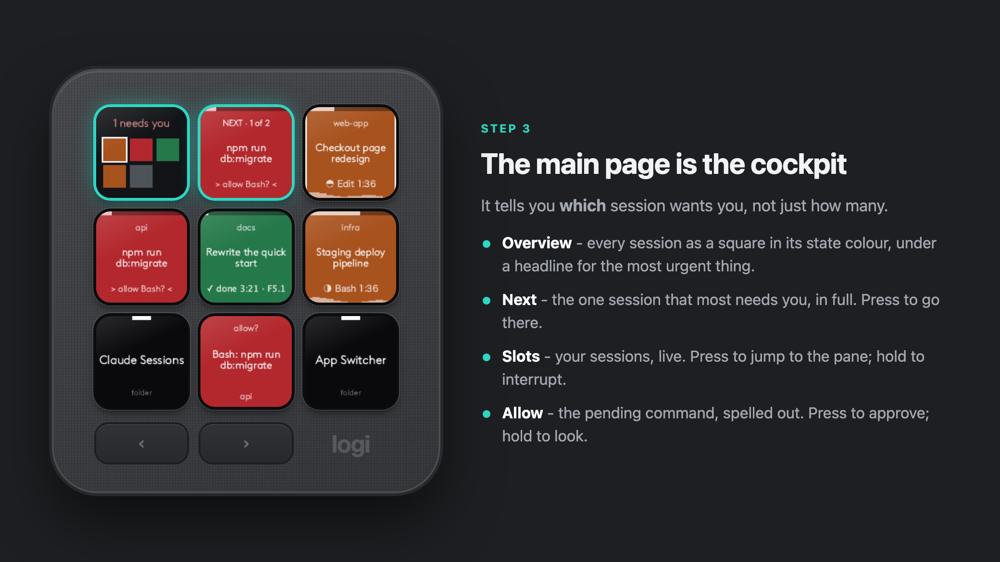
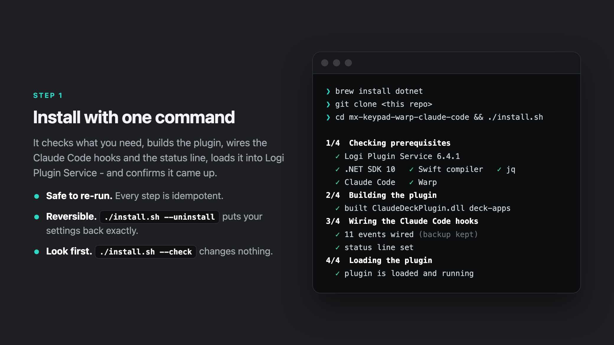
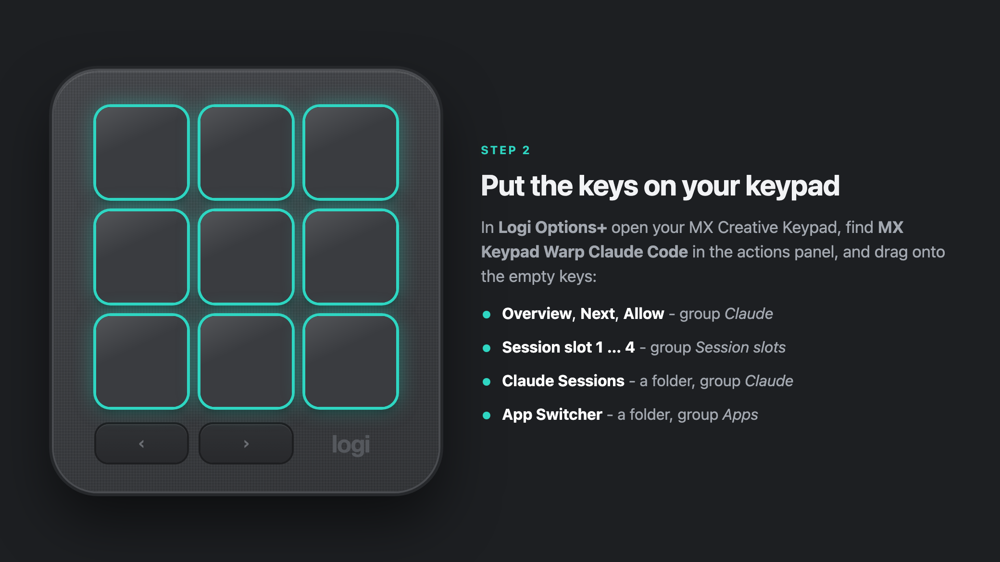
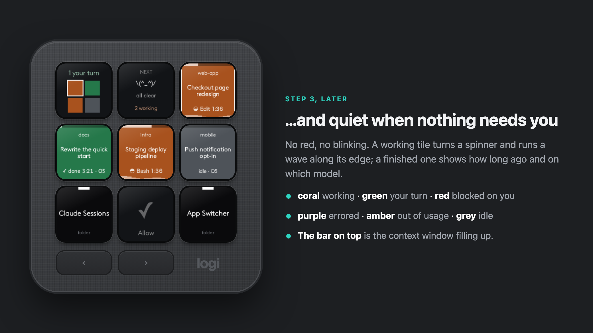
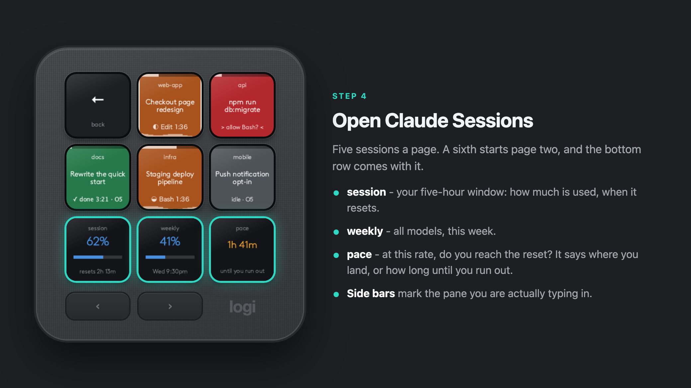
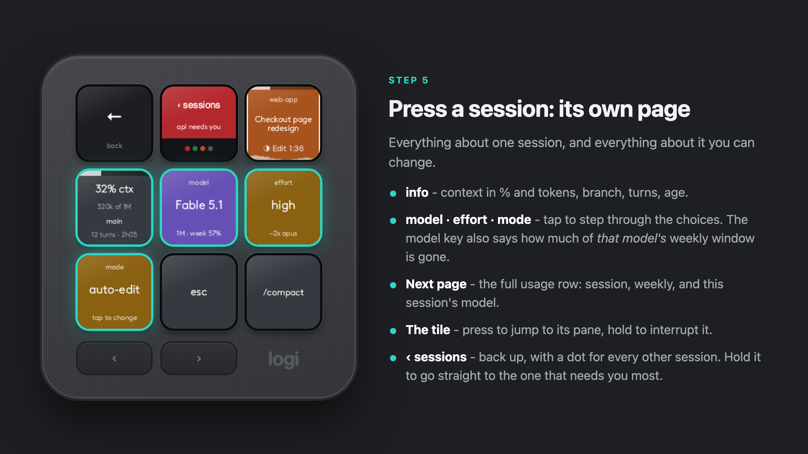
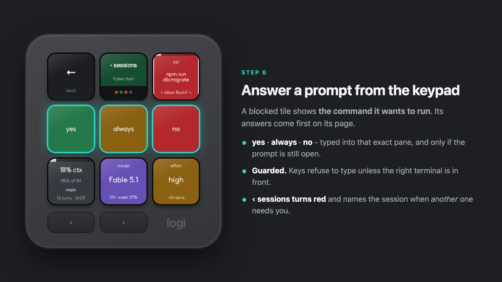
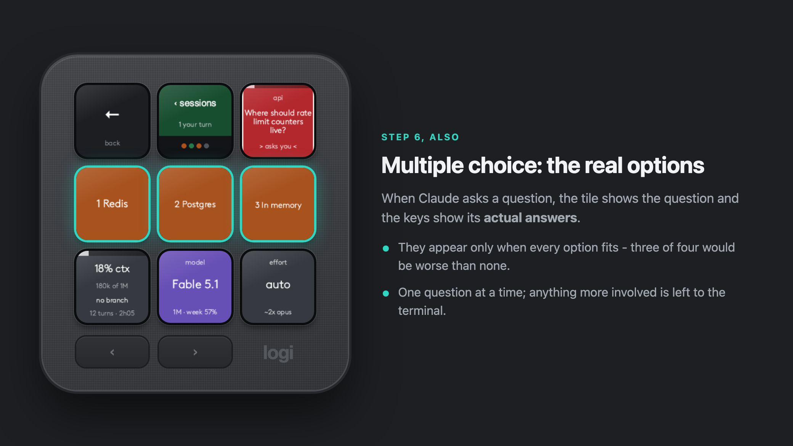
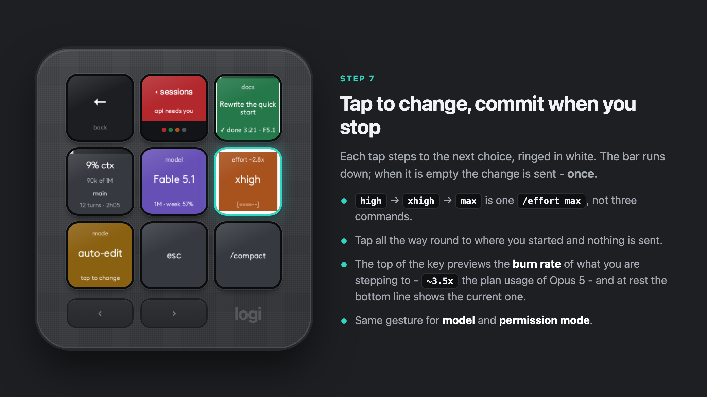
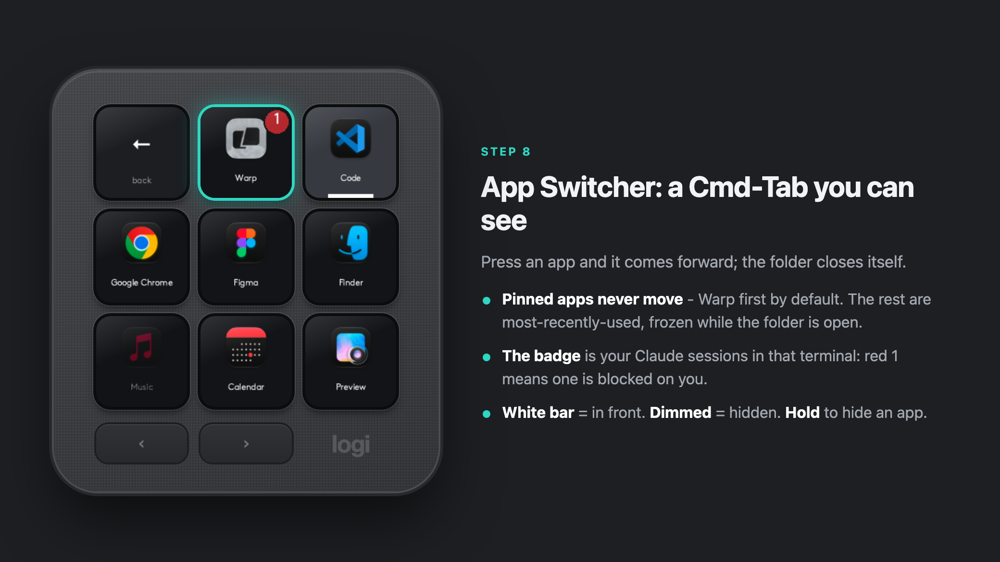

# mx-keypad-warp-claude-code

Every running [Claude Code](https://claude.com/claude-code) session as a live tile on a **Logitech MX
Creative Keypad** — jump to it, answer its permission prompts, interrupt it — and a buzz on an
**MX Master 4** when one needs you.

<p align="center"></p>

## Quick start

```sh
brew install dotnet
git clone https://github.com/hshekhar-git/mx-keypad-warp-claude-code.git
cd mx-keypad-warp-claude-code
./install.sh
```

Then drag the keys onto your keypad in Logi Options+ and grant Accessibility - the
[full walkthrough](#install) has every step, a way to check it works, and
[troubleshooting](#troubleshooting).

## The tour, in pictures

Every tile below was drawn by the plugin's own renderer (`tools/make-steps.sh` regenerates them).

| | |
|---|---|
|  |  |
|  |  |
|  |  |
|  |  |
|  |  |

## The main page

Counts tell you *how many* sessions want something. These keys tell you *which*, and get you there -
so the page you look at while doing something else is the cockpit, not a menu.

```
┌──────────────┬──────────────┬──────────────┐
│   OVERVIEW   │     NEXT     │    slot 1    │
│ 1 needs you  │   web-app    │  live tile   │
│   ■ ■ ■ ■    │ allow Bash?  │              │
├──────────────┼──────────────┼──────────────┤
│    slot 2    │    slot 3    │    slot 4    │
│  live tile   │  live tile   │  live tile   │
├──────────────┼──────────────┼──────────────┤
│    Claude    │    Allow     │ App Switcher │
│   Sessions   │              │              │
└──────────────┴──────────────┴──────────────┘
```

| Key | Shows | Press |
|---|---|---|
| **Overview** | every session as a square in its state colour, under a headline for the most urgent thing: `1 needs you` → `2 errored` → `1 at limit` → `2 your turn` → `3 working`. The white-edged square is the session the keys act on | walks the sessions that want you, most urgent first |
| **Next** | the *one* session that most deserves you, as a full live tile - the command it wants to run, the question it asked, `limit · 4:40am` - headed `NEXT · 1 of 3`. When nothing wants you: `all clear · 2 working` | goes to it. Dealing with it is what moves the queue on |
| **Session slot 1-8** | your sessions *on the main page*: slot 3 is the third session, in the same stable order as the list (Warp window, tab, pane), so a session keeps its key for as long as it lives | jumps to its pane - which also makes it the target of **Model**, **Effort**, **Permission mode** and **Allow**. **Hold** to interrupt it |

The queue behind *Overview* and *Next*: blocked on you (longest first), then errored, then out of
usage, then finished (longest ago first). Working and idle sessions want nothing, so they are not in it.

Slots and the folder are the same sessions at two depths: a slot is one press to the pane; **Claude
Sessions** is where a session's own page lives (info, model, effort, mode, answers).

## Plan usage on the keypad

The list inside **Claude Sessions** keeps its bottom row for your plan:

```
┌───────────┬───────────┬───────────┐
│  ‹ Back   │ session 1 │ session 2 │   five sessions a page; a sixth starts page two,
├───────────┼───────────┼───────────┤   and the usage row comes with it
│ session 3 │ session 4 │ session 5 │
├───────────┼───────────┼───────────┤   session   the five-hour window: % used, resets in 2h 13m
│  session  │  weekly   │fable week │   weekly    all models, this week: % used, resets Wed 9:30pm
│    88%    │    65%    │    57%    │   third key a model's own weekly window, or pace - see below
└───────────┴───────────┴───────────┘
```

**The third key** is a per-model weekly window - `Current week (Fable)` on the usage page - when your
plan keeps one. In the list it is whichever is fullest; **on a session's page it is the one that counts
that session's model** - there the row comes after the page's own keys, on the next page, and the
model key carries the same figure (`week 57%`) so it is in sight without paging. When there is no such window (or none for that model), it shows pace.

**Pace** answers "do I make it to the reset?". From how much of the five-hour window has gone and how
much you have used, it projects where you land: `~85% by the reset` in green if you make it, or
`22m until you run out` in amber/red if you do not. Blue below 75%, amber from 75%, red from 90%.

**Where the numbers come from.** Claude Code passes its status line a payload that includes your plan
usage, so the installer sets a status line command (`deck-statusline.sh`) that copies those numbers to
`~/.claude/deck/usage.json` - and, per session, the exact model, effort and context fill, which replace
what was otherwise inferred from transcripts.

The per-model window is not in that payload - nor in anything else Claude Code hands out. So while a
usage key is on show, and at most every five minutes, the plugin asks Claude Code for it: it runs
`claude -p /usage --no-session-persistence`, which prints the usage page as text (no model call, no
tokens, no session saved), and reads the `Current ...: N% used` lines. **Press any usage key** to ask
again now. `"usage": { "perModel": false }` turns this off, and the third key goes back to pace.

The plugin itself reads **no credentials and opens no network connection**: the status line is Claude
Code telling it, and the probe is Claude Code being asked - signing in and calling home exactly as it
does when you type `/usage`.

- If you had a status line already, it is kept: yours still runs on the same input and its output is
  what you see. With none, you get a small one: `Fable 5.1 · ctx 32% · 5h 88% · wk 65%`.
- Each session reports the figures from *its own last API response*, so a session idle since Tuesday
  reports Tuesday's. A report only counts if its session has been active more recently than the one
  on file; numbers older than 20 minutes are shown greyed with their age.
- When no session has been active for a while, the probe's figures stand in for the status line's, so
  the row is not left greyed out just because everything is idle.
- The probe runs from `~/.claude/deck`, which leaves one empty folder for that path under
  `~/.claude/projects`. The hook ignores it, so it never appears as a session.
- The same three keys exist for the main page under **Usage**. `"usageRow": false` gives the list all
  eight keys back; `"pageUsageRow": false` leaves the row off a session's page.

## Two layers

**Claude Sessions** opens a list of every running session (five to a page above the usage row). **Press
one and you are on that session's own page:**

```
┌───────────┬───────────┬───────────┐
│  ‹ Back   │ ‹ sessions│  the tile │   ‹ sessions  up one level - and the other sessions' way of
│ (Options+)│  ● ● ●    │ Edit 2:31 │                 tapping you on the shoulder (see below)
├───────────┼───────────┼───────────┤   the tile    live; press = jump to its pane, hold = interrupt
│  32% ctx  │   model   │  effort   │   info        context % and tokens, branch, turns, age
│ 317k of 1M│ Fable 5.1 │   high    │   model       tap to step (see Model switch); underneath, how
│ feat/hero │1M·week 57%│ ~2x opus  │               much of THAT model's weekly window is gone
├───────────┼───────────┼───────────┤   effort      auto · low · medium · high · xhigh · max · ultracode;
│   mode    │    esc    │ /compact  │               underneath, how fast this burns the plan (see below)
│ auto-edit │           │           │   mode        ask · auto-edit · plan · [bypass] · [auto]
└───────────┴───────────┴───────────┘   then your command keys; more on the next page ▶
  next page ▶  any further command keys, then the usage row along the bottom:
               session · weekly · this session's model (fable week 57%)
```

`"pageUsageRow": false` leaves the usage row off the session's page.

While the session is **blocked**, the answers come first, straight after the tile: **yes / always / no**
for a permission prompt, the **actual option labels** for a multiple-choice question.

**While you are inside one session, the `‹ sessions` key watches the rest.** It blinks **red** with
the name - `web-app needs you` - when another session is blocked on you (`2 need you` for several),
turns **green** with `2 your turn` when others have finished, and otherwise just counts them. Along
its bottom edge is one dot per other session in its state colour, so the whole deck is readable
without leaving the page. **Press** it for the list; **hold** it to skip the list and land directly on
whichever session needs you most (blocked longest, else errored, else finished longest ago).

**Out of usage** - when a session hits your usage limit its tile turns **amber** and reads
`limit · 4:40am` (when it lifts), and its page gains a **continue at low priority** key, which sends
`/low-priority`. It is read from the transcript: the newest reply being a `rate_limit` error means
limited; any later reply, or the reset time passing, means not.

- **Everything that can be changed is changed the same way:** tap to step through the choices, ringed
  in white; it is sent once, a second and a half after your last tap. Tapping back round to the value
  in use sends nothing.
- **The effort key's bottom line is the burn rate**: how fast the session eats your plan at that model
  and effort, as a multiple of **Opus 5 at its default effort (high)**. `~2x opus` on Fable 5.1 at
  high; tap towards `max` and the top of the key previews what you are stepping to (`effort ~3.5x`).
  Two things set it: the model's price per token, and how much more it thinks at a higher effort -
  both from Claude Code's own model table (the `effort_cost_index` it uses to say "~1.4x" when you
  change effort). Plan usage is charged in proportion to price, so the product is the multiple.

  | | low | medium | high | xhigh / ultracode | max |
  |---|---|---|---|---|---|
  | **Opus 5** | ~0.67x | ~0.76x | **1x** | ~1.6x | ~1.7x |
  | **Fable 5.1** | ~1.5x | ~1.7x | ~2x | ~2.8x | ~3.5x |
  | **Sonnet 5** | ~0.19x | ~0.3x | ~0.4x | ~0.96x | ~2.2x |
  | **Haiku 4.5** | ~0.2x | ~0.2x | ~0.2x | ~0.2x | ~0.2x |

  The table is Claude Code 2.1.278's (`plugin/src/Sessions/ModelCosts.cs`); a model it does not
  list gets no line rather than a wrong one. It is a rate, not a bill: `~2x` means the same work
  drains the weekly window twice as fast as it would on Opus 5.
- **Effort** is read from the session's own `/effort` history (the whole transcript is searched once,
  since one early `/effort` can be megabytes back), else `effortLevel` in your settings, else `auto`.
- **Permission mode** is changed with Shift-Tab, so a change is sent as that many steps round Claude
  Code's own cycle. `bypass` and `auto` are only stops on that cycle if they are enabled for you, and
  nothing says whether they are - so each joins the key's choices once a session has been seen on it.
- The mode itself is read from the session's **transcript**, where Claude Code notes a change the
  moment it happens - so it is known for a resumed session before its first prompt, and it follows a
  Shift-Tab you press by hand. A brand-new session that has said nothing yet shows what your other
  sessions are on, with a question mark (`auto?`), because that is a guess. Mode changes work
  mid-turn; model and effort are refused while the session is busy.
- **Once you answer a prompt from the keypad, its answer keys go away** and the tile turns to
  working. Claude Code reports a prompt appearing but never its being answered, so without this the
  keys would stay live until the approved command finished - with **no** sending an Escape into it.
- Reopening the folder starts at the list - unless exactly one session is blocked on you, in which
  case it opens straight onto that one.
- **Model**, **Effort** and **Permission mode** also exist as home-page keys, acting on the target
  session (the pane you are in, else the last one you opened).

## What a tile tells you

```
▓▓▓▓▓▓░░░░░░░░  ← context window fill (yellow past 80%)
  web-app   ← project (git top level)
 Landing page   ← Claude's own session title, else your last prompt
 hero rework
 ◐ Bash 2:31    ← what it is doing right now, and for how long - behind a turning spinner
▂▃▅▇▅▃▂▁▂▃▅▆▅▃  ← a wave of block characters flowing past while it works
```

**The tiles move.** Everything animated is drawn from characters, four frames a second:

| When | What you see |
|---|---|
| working | a half-filled circle turning beside the status - `◐ ◓ ◑ ◒` - and two sine waves of `▁▂▃▄▅▆▇█` sliding past each other along the bottom edge |
| blocked on you | the tile blinks and arrows close in on the question: `>  allow Bash?  <` → `> allow Bash? <` → `>allow Bash?<` |
| a turn just finished | three seconds of a twinkling diamond - `◇ ◆` - then it settles to `✓ done 0:03` |
| tapping model / effort / mode | a bar runs down - `[======]` → `[===---]` → `[=-----]` - showing how long until your taps are taken as final |
| nothing to show | `\(^_^)/ all clear`, `(-_-) zzZ no sessions`, `[   ]` for an empty slot |

Only glyphs that were rendered and checked are used, because the renderer draws each string in **one
typeface**: a mark that shares a line with words has to come from the key's main font (half-circles,
dots, diamonds, a tick, right-pointing arrows, block elements are in it), or it drags the whole line
into a symbol font with no letters and the words come out as boxes - which rules out stars and
braille beside text. Animation only runs for tiles that are actually moving. `"style": "plain"` in the config turns it all off.

| Colour | State | From |
|---|---|---|
| coral | **busy** — shows the running tool and turn time | `UserPromptSubmit`, `PreToolUse`, `PostToolUse`, `PreCompact` |
| green | **done** — your turn, with how long ago | `Stop` |
| red, blinking | **attention** — blocked on you. A permission prompt shows *the command it wants to run*; `AskUserQuestion` shows "asks you"; `ExitPlanMode` shows "plan ready" | `PermissionRequest`, `Notification`, `PreToolUse` |
| purple | **error** — the turn died | `StopFailure` |
| amber | **limit** — out of usage until the time shown | the transcript's `rate_limit` reply |
| grey | **idle** - with a short model tag, as on finished tiles: `idle · F5.1` | `SessionStart` |

## App Switcher

A Cmd-Tab you can see. Put **App Switcher** on one key; press it and every running app is a key with
its real icon. Press one and it comes to the front, and the folder closes itself - one gesture.

- **Pinned apps come first and never move** (Warp by default), because a key you have learned beats a
  perfectly sorted list. Everything else is most-recently-used, like Cmd-Tab.
- The order is **frozen while the folder is open**, so tiles do not shuffle under your finger.
- The app in front has a white bar; hidden apps are dimmed; **hold** a key to hide that app.
- A terminal hosting Claude sessions wears a **badge in the deck's colours** - red 2 means two sessions
  there are blocked on you - so the switcher tells you *why* to go to Warp, not just how.
- **Open App** is the one-key version: set it to "Warp" in its Options+ form and it is a direct
  switch-to-Warp key with the same icon and badge.

Driven by a small native helper (`helper/deck-apps.swift`) that pushes a line when an app launches,
quits, activates or hides - nothing polls - and exits by itself when the plugin goes away.

## Model switch

**Model** is a live key: it shows which model the target session is set to - `Fable 5.1`, with
`1M context` underneath when it is on the big window - in that model's colour, and the project it
belongs to. Resting tiles carry the same thing as a short tag: `done 5:12 · F5.1`.

**Tap to change it.** Each tap steps to the next model in your list, ringed in white; the switch is
sent once, about a second and a half after your last tap. So Fable → Sonnet, passing Opus, is *one*
`/model`, not two - which matters, because Claude Code's `/model` also saves the choice as your
default for new sessions. Tapping all the way round to the model already in use sends nothing.

**Models** is the same thing as a folder: every model as a key, the one in use marked, press to set.

- The status is read from the session's transcript: the most recent of "a `/model` switch" and "the
  model that wrote the last reply". A switch shows up about a second after it is made.
- A switch is refused - the key says `busy - wait` - while the session is mid-turn or blocked on a
  prompt, because text typed then would be queued as a message or land in a dialog.
- It acts on the **target session** (the pane you are in, else the tile you last pressed); with
  exactly one session running, that one.
- The list is `models` in `config.json`. The defaults type `fable`, `opus`, `sonnet`, `haiku`; put a
  full id such as `claude-opus-5[1m]` in `alias` if you want a specific version or window.

## Keys

**Inside the *Claude Sessions* folder** - see [Two layers](#two-layers). In the list, side bars mark
the pane you are actually in; every press flashes the key; **hold** a tile to interrupt that session
without opening it.

**On your home page** (drag from Options+ → *MX Keypad Warp Claude Code*)

| Key | Shows | Press |
|---|---|---|
| **Overview**, **Next**, **Session slot 1-8** | see [The main page](#the-main-page) | |
| **Usage: session / weekly / pace** | see [Plan usage on the keypad](#plan-usage-on-the-keypad) | nothing - they are gauges |
| **Needs me** | one number: the size of the most urgent group that has anyone in it - blocked on you, else errored, else at the usage limit, else finished - in that group's colour and under its name. With nobody waiting: how many are working | walks exactly the sessions it is counting, longest-waiting first |
| **Working** | how many are still running | walks them |
| **Allow** | the oldest open permission prompt *spelled out*: tool, command, project | **allows it**. **Hold** to go and look instead |
| **Model** | the target session's model, and whether it is on the 1M window | steps to the next model; commits when you stop tapping |
| **Effort** | its effort level, and the burn rate against Opus 5 (`effort · ~2x`) | steps `auto → low → medium → high → xhigh → max → ultracode` (xhigh plus multi-agent orchestration, this session only) |
| **Permission mode** | `ask`, `auto-edit`, `plan`, and `bypass` / `auto` where enabled | steps it (Shift-Tab) |
| **Commands → …** | each key from `config.json` | types it, only if a terminal is already in front |
| **Send to Claude** | a label you choose | text + Return configured in the Options+ form |
| **App Switcher**, **Open App** | see [App Switcher](#app-switcher) | |
| **Models** | a folder: every configured model, the one in use marked | sets it - see [Model switch](#model-switch) |

**Haptics (MX Master 4)** — three events, remappable in Options+: *Claude needs you* (`knock`),
*Claude finished* (`completed`, only for turns longer than 20 s), *Claude errored* (`angry_alert`).

### Safety of the typing keys

- Every keystroke is sent by one AppleScript that first checks which app is in front and refuses if
  it is not the expected terminal — a mistimed press cannot type into your editor.
- An answer key re-reads the session's state at the last moment; if the prompt is already gone, no
  digit is typed.
- "always" sends `2`. On a prompt that only offers yes/no, `2` is *no* — it fails safe.
- Text is passed as an argument, never interpolated into a script or a shell.
- The hook only writes a file and exits 0. It never returns a permission decision, so it cannot
  approve, deny or slow anything, and it coexists with your other hooks.

## Install

### What you need

| | |
|---|---|
| **macOS** | Apple Silicon or Intel. Focus and typing use macOS APIs, so there is no Windows build |
| **Logitech MX Creative Keypad** | plugged in and showing up in Logi Options+ |
| **Logi Options+** with Logi Plugin Service **6.4 or newer** | 6.4 is the first release on .NET 10. Check: *Options+ → Settings → About*, or run `./install.sh --check` |
| **[Claude Code](https://claude.com/claude-code)** | the `claude` CLI |
| **[Warp](https://www.warp.dev)** | for exact-pane focus. Other terminals work, with app-level focus only |
| **Homebrew** | to install the two build tools below |
| *optional:* **MX Master 4** | for the haptic buzz |

### Step 1 — build tools (once)

```sh
brew install dotnet          # .NET 10 SDK - no sudo needed (the dotnet-sdk cask wants sudo; this does not)
xcode-select --install       # Swift compiler, for the app-switcher helper. Skip if Xcode or the CLT is installed
```

`jq` ships with macOS 15 and later. On anything older: `brew install jq`.

### Step 2 — get the code and install

```sh
git clone https://github.com/hshekhar-git/mx-keypad-warp-claude-code.git
cd mx-keypad-warp-claude-code
./install.sh
```

`install.sh` does four things and tells you which one failed if one does:

1. **Checks prerequisites** — macOS, Logi Plugin Service version, .NET 10, swiftc, jq, Claude Code, Warp.
2. **Builds** the plugin DLL and the native `deck-apps` helper, and writes a `.link` file into
   `~/Library/Application Support/Logi/LogiPluginService/Plugins/` pointing at this folder.
3. **Wires 11 Claude Code hooks and the status line** into `~/.claude/settings.json`. Additive: your
   other hooks are not touched, an existing status line is kept and still runs, the pre-install file is kept as `settings.json.claudedeck.bak`, and re-running never
   stacks duplicates. It also copies the hook to `~/.claude/deck/deck-hook.sh` and seeds
   `~/.claude/deck/config.json`.
4. **Loads the plugin** and waits until it sees it running.

> **Keep the folder where you cloned it.** The plugin runs from here. If you move or rename the
> folder, run `./install.sh` again - it notices and restarts Logi Plugin Service for you.

### Step 3 — put the keys on your keypad

Open **Logi Options+ → MX Creative Keypad**. In the actions panel find the plugin
**MX Keypad Warp Claude Code** and drag these onto keys:

| Drag this | Group | Put it |
|---|---|---|
| **Claude Sessions** | Claude | any home-page key - it is a folder; pressing it opens the deck |
| **App Switcher** | Apps | any home-page key - also a folder |
| **Overview**, **Next**, **Allow** | Claude | home page - see [The main page](#the-main-page) |
| **Session slot 1…8** | Session slots | home page - as many as you usually have sessions |
| *optional:* **Needs me**, **Working** | Claude | the plain counts, if you prefer numbers |
| *optional:* **Model**, **Effort**, **Permission mode** | Claude | home page - the same controls as on a session's page, for the target session |
| *optional:* **Models** | Claude | a folder: pick a model from a list instead of tapping through |
| *optional:* **Open App** | Apps | a direct "go to Warp" key: type `Warp` in its form |
| *optional:* anything under **Commands**, or **Send to Claude** | Commands / Claude | home page |

### Step 4 — allow typing

Needed only by keys that type: `esc`, `/compact`, **yes / always / no**, **Allow**, holding a tile to
interrupt. Status, colours, the app switcher and jumping to a pane work without it.

**System Settings → Privacy & Security → Accessibility →** enable **Logi Plugin Service**.
(If it is not listed, press a typing key once - macOS adds the entry when the first keystroke is
blocked - or add `/Applications/Utilities/LogiPluginService.app` with the **+** button.)

### Step 5 — haptics (MX Master 4 only)

**Logi Options+ → MX Master 4 → Haptic feedback →** enable **MX Keypad Warp Claude Code**. The three
events (*Claude needs you*, *Claude finished*, *Claude errored*) can each be given a different
waveform there.

### Step 6 — check that it works

1. Open a **new** Warp tab and run `claude`. Hooks are read when a session starts, so sessions that
   were already running only show up on their next tool call.
2. Press **Claude Sessions** on the keypad. You should see a **grey** tile named after the folder,
   above the three usage keys.
3. Send a prompt. The tile turns **coral**, a half-circle turns beside the tool it is using, and a
   wave flows along its bottom edge.
4. When Claude finishes it turns **green**; on your home page *Overview* reads `1 your turn` and
   *Next* shows that session.
5. Click into another app, press **App Switcher**, press **Warp** - Warp comes forward and the folder
   closes.
6. Ask Claude to run something it needs permission for (`run ls in /tmp`). The tile blinks **red** and
   shows the command. Press the tile to open that session's page: **yes / always / no** are the keys
   right after it. (*Allow* on the home page shows the same prompt and approves it in one press.)
7. On that page, tap **effort** a couple of times and stop: about a second and a half later
   `/effort <level>` is typed into the session and the key shows the new level.

No tile? `ls ~/.claude/deck/sessions/` should hold one `.json` per running session. If it is empty
the hooks are not firing - see below.

### Updating

```sh
git pull && ./install.sh
```

### Uninstalling

```sh
./install.sh --uninstall     # removes the hooks and the plugin link, restarts Logi Plugin Service
rm -rf ~/.claude/deck        # optional: config, cached icons, session files
```

### Doing it by hand

`install.sh` is only these three commands plus checks:

```sh
source env.sh                                                  # points DOTNET_ROOT at Homebrew's dotnet
dotnet build plugin/src/ClaudeDeckPlugin.csproj -c Release     # build + link + reload
hooks/install-hooks.sh                                         # wire the hooks
```

## Reaching another keypad profile

Options+ swaps keypad **profiles** by the app in front: a Warp profile while you are in Warp, your
default profile everywhere else. To get from one to the other by hand - say, to your app-launcher
profile while Warp is in front - use Options+'s own action, which needs no plugin:

1. Logi Options+ → MX Creative Keypad → pick the profile you want the button **on** (e.g. *Warp*).
2. In the actions panel search **profile**; the built-in action is described as *"Switches current
   device profile to selected one"*.
3. Drag it to a free key and choose the target, e.g. **Default General Profile**.

Alternatively put **App Switcher** (or an **Open App** key) on the Warp profile: this plugin's
actions work on every profile.

## Troubleshooting

| Symptom | Cause and fix |
|---|---|
| The plugin is not in the Options+ action list | It did not load. Quit and reopen `/Applications/Utilities/LogiPluginService.app`, then look at `~/Library/Application Support/Logi/LogiPluginService/Logs/plugin_logs/ClaudeDeck.log` |
| Log says `Cannot load plugin ... because plugin 'ClaudeDeck' is already loaded` | Harmless on its own - the service enumerates plugins twice and stock plugins log the same line. It only matters right after **moving the folder**: the old copy is still in memory. Run `./install.sh` again, or restart Logi Plugin Service |
| Log says `Cannot load plugin from '<path>.dll'` | The service refused the assembly. Two known causes: a copy of `PluginApi.dll` in the plugin folder (the project references it with `Private="false"` so that cannot happen - `dotnet build ... -t:Clean` and rebuild), or an assembly with no `ClientApplication` type in it, which the service requires even of a plugin that follows no application (`Helpers/NoApplication.cs`). A refused plugin stays disabled until Logi Plugin Service is restarted |
| `dotnet: command not found`, or *"You must install .NET"* | `brew install dotnet`, and build through `./install.sh` (or `source env.sh` first): Homebrew's dotnet needs `DOTNET_ROOT` set |
| Build fails at `swiftc` | `xcode-select --install` |
| Folder opens but shows **Not set up** | The hooks are not in `~/.claude/settings.json`. Run `hooks/install-hooks.sh` |
| Folder shows **No sessions** while Claude is running | That session started before the hooks were installed - start a new one. Also confirm `jq` exists: the hook exits silently without it |
| Tiles work, but `esc` / `yes` / `/compact` do nothing | Accessibility permission (Step 4). After an Options+ update macOS sometimes drops it: toggle the entry off and on |
| A key types nothing and the log says `... is in front, not ...` | Working as designed: typing keys refuse unless the expected terminal is frontmost. Press the session tile first |
| App Switcher shows **No apps** | The helper is not running: `pgrep -fl deck-apps`. Rebuild with `./install.sh`; the log says why if it cannot start |
| All Warp sessions land on one page | Warp changed its internal database layout. Status and focus still work; only per-tab paging is lost. Please open an issue |
| **Model** shows `?` | No reply has been written in that session yet and no `/model` switch was made, so there is nothing to read. It fills in after the first turn |
| A model switch types `/model x` but Claude Code rejects it | That alias is not one your Claude Code version knows. Put the full model id in `alias` in `config.json` |
| Usage keys say `no data yet` | They fill in when a session next draws its status line - send any prompt. On an API key, Bedrock or Vertex there are no plan limits to show |
| Usage keys are grey with `35m old` | No session has talked to the API for that long; the numbers refresh on the next reply |
| Usage differs from the usage page | The keys show what Claude Code derives from the rate-limit headers of its latest API response; the page is computed server-side and can disagree. Compare with `/usage` inside Claude Code |
| No buzz on the MX Master 4 | Step 5, and check `"haptics"` in `~/.claude/deck/config.json`. *Claude finished* only fires for turns longer than `minTurnSeconds` (20) |

## Configuration

`~/.claude/deck/config.json` - comments allowed, re-read within a second of saving, no restart. A file
that does not parse keeps the previous settings. [`config.example.json`](config.example.json) is the
annotated version; the installer seeds your copy from it.

| Setting | What it controls |
|---|---|
| `label` | the main text on a tile: `"title"` (Claude's own session title, else your last prompt), `"prompt"`, or `"slug"` |
| `style` | `"ascii"` (animated, the default) or `"plain"` |
| `showContext` | the context-window gauge along the top of each tile |
| `contextWindow`, `contextWindows` | the window size the gauge is measured against, when Claude Code has not said (it usually has - see [Plan usage](#plan-usage-on-the-keypad)) |
| `haptics` | `attention` / `done` / `error` on or off, and `minTurnSeconds`: a turn shorter than this finishing is not announced |
| `sessions` | `group`: `"flat"` or `"tab"` (one page per Warp tab) · `focusOnOpen`: opening a session also brings its pane forward · `usageRow`: the three usage keys under the list · `pageUsageRow`: and under a session's page |
| `usage` | `perModel`: ask Claude Code (`claude -p /usage`) for the per-model weekly window while a usage key is showing · `claudePath`: where `claude` is, if not in `~/.local/bin`, `/opt/homebrew/bin` or `/usr/local/bin` |
| `models` | what **Model** steps through and **Models** lists: `alias` (typed after `/model`), `label`, `match`, `color` |
| `apps` | the App Switcher: `pinned` and `hidden` bundle ids, `order` (`recent` / `launch` / `name`), `closeOnSwitch` |
| `keys` | the command keys on every session's page, also published under **Commands** for your home page: `label`, `text`, `submit`, `key` (`"escape"`), `color`, and an optional `id` |

A key you have placed from **Commands** is remembered by its `id` - or, without one, by what it
*does* (its text, whether it submits, the special key it sends). So relabelling or reordering keys
never unbinds one, and giving a key an `id` lets you change even what it types.

## How it works

```
 claude ─ hooks (11 events) ─► deck-hook.sh ─ one jq run, atomic write ─► sessions/<key>.json ──┐
          key = Warp pane uuid, else Claude session id                                          │
                                                                                                │
 claude ─ status line ───────► deck-statusline.sh ─► usage.json            (plan usage) ────────┤
                                                  └► status/<session>.json (model, effort, ctx) │
                                                                                                ▼
 warp.sqlite ─ read-only, JSON ─► which tab, which pane has the keyboard ─┐   FolderWatch: a burst of
 transcript tail ─► title, /model and /effort history, usage-limit hits ──┤   writes settles into one
                                                                          ▼   reload, plus a 2 s check
 NSWorkspace ─► deck-apps (Swift) ─ a JSON line per change ─► AppWatcher ─► SessionStore
                                                                  │              │
                          App Switcher, "you are here", badges ◄──┘              ├─► every key and tile
                                                                                 └─► state changes ─► haptic
                                                                                     events ─► MX Master 4
```

Everything under `~/.claude/deck/`: `sessions/` (one file per live session), `status/`, `usage.json`,
`icons/` (app icons, cached), `config.json`, and the installed copies of the two scripts.

The hooks and the plugin never talk to each other directly: a hook writes a small JSON file and is
done, and the plugin watches the folder. That is deliberate. A hook runs inside your Claude session,
so it has to be fast and it has to be harmless - with no plugin running, a full disk or a missing
`jq`, it still exits cleanly and the session never notices. And because the state is on disk, a
plugin reload or an Options+ update picks up exactly where it left off. A session's file is removed
when the session ends, or when its `claude` process is found to be gone.

## Developing

```sh
dotnet build plugin/src/ClaudeDeckPlugin.csproj              # Debug build + reload
DYLD_LIBRARY_PATH=/Applications/Utilities/LogiPluginService.app/Contents/MonoBundle \
  dotnet fsi tools/preview.fsx out/                          # render every tile to PNG, no keypad needed
tail -f ~/Library/Application\ Support/Logi/LogiPluginService/Logs/plugin_logs/ClaudeDeck.log
```

```
install.sh                    prerequisites, build, hooks, load, verify        (--check, --uninstall)
hooks/deck-hook.sh            the Claude Code hook: one session's state -> one JSON file
hooks/deck-statusline.sh      the status line tap: plan usage, and each session's model/effort/context
hooks/install-hooks.sh        edits ~/.claude/settings.json - additive, idempotent, reversible
helper/deck-apps.swift        native app watcher: pushes running/frontmost apps, extracts icons
plugin/src/
  ClaudeDeckPlugin.cs         lifetime of the background pieces; state changes -> haptic events
  Actions/                    everything you can put on a key
    SessionsFolder.cs           the list, and a page per session
    MainPageCommands.cs         Overview, Next, Session slots
    SessionKeyCommand.cs        Needs me, Working, Allow - and Urgency, the one ranking they all use
    ModelCommand.cs             Model, Effort, Permission mode     ModelsFolder.cs
    UsageCommand.cs             the usage gauges                   AppSwitcherFolder.cs, OpenAppCommand.cs
    ConfiguredKeyCommand.cs     keys from config.json              SendToClaudeCommand.cs
  Sessions/                   SessionStore (the source of truth), TranscriptStats, UsageStore, Settings
                              (tap-to-step), Deck (what a press does), DeckConfig, ModelNames, HookStatus
  Term/                       WarpTabs (layout), TermFocus (go to a pane), TermInput (guarded typing)
  Apps/                       AppWatcher, Apps
  Rendering/TileRenderer.cs   every pixel
  Helpers/                    FolderWatch, Shell, PluginLog, NoApplication
  package/                    manifest, icon, haptic event definitions
tools/                        preview.fsx (tiles -> PNG), make-icon.swift,
                              steps.fsx + make-steps.sh (the pictures in this README)
docs/steps/                   steps.html - the walkthrough as a page - and the PNGs taken of it
```

## Limits

- macOS only. Exact-pane focus is Warp only; in any other terminal a press brings the *app* forward.
- `warp.sqlite` is Warp's private format. If it changes, the query fails quietly and Warp sessions
  are listed by app instead of by tab, without the "you are here" mark; status and focus carry on.
- A session that was already running when the hooks were installed appears on its next event.
- The five-hour and weekly (all models) windows are as fresh as the most recently active session's
  last API response. A per-model weekly window comes from asking `claude -p /usage`, read as text: up
  to five minutes old, and if Claude Code rewords that page the third key falls back to pace.
- A prompt you answer **in the terminal** (rather than from the keypad) leaves its tile red until the
  approved command finishes: Claude Code has no event for "the prompt was answered".
- Keys that type (answers, command keys, model / effort / mode) need Accessibility, and refuse to
  type unless the expected terminal is in front; model and effort are also refused mid-turn.

The plugin's internal id is `ClaudeDeck` (log file name, reload URL, `~/.claude/deck/`). It is kept
stable on purpose: Options+ binds the keys you have placed to that id.

MIT.
